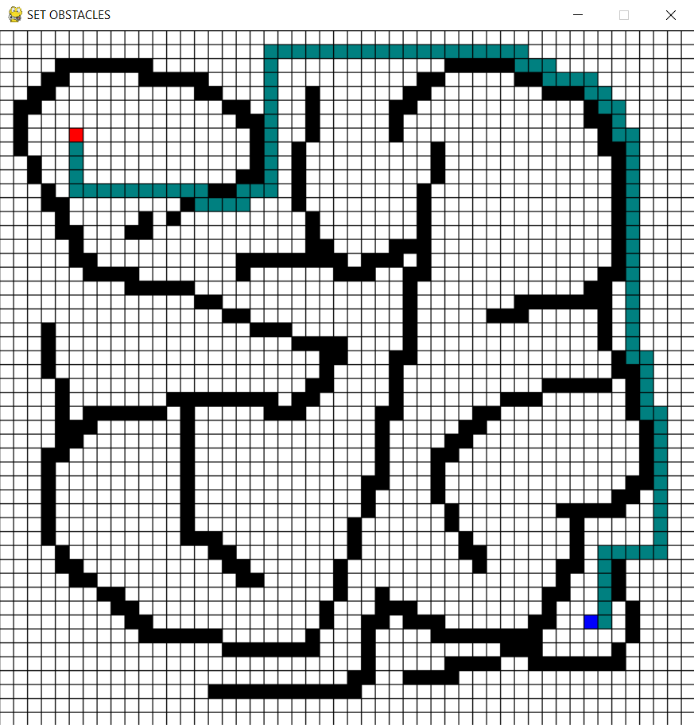

# Introduction

This is a simple path finder which visualises the breadth-first algorithm, using it to find the shortest path between
two points.

## Screenshot

## Usage

Use the '1' key to set to set to start mode, used to set the starting position, then similarly use the '2' key to set
the end position, and then finally, use the '3' key to set the obstacles. Then press the spacebar key to start the
algorithm.
  